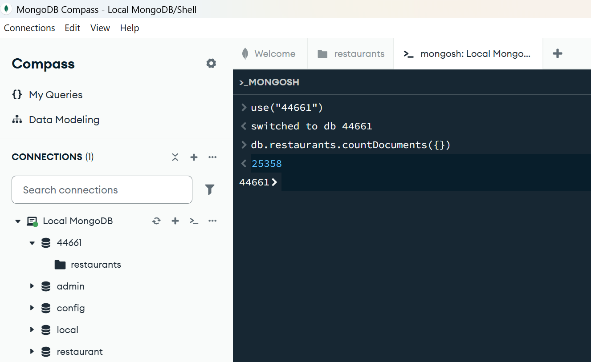
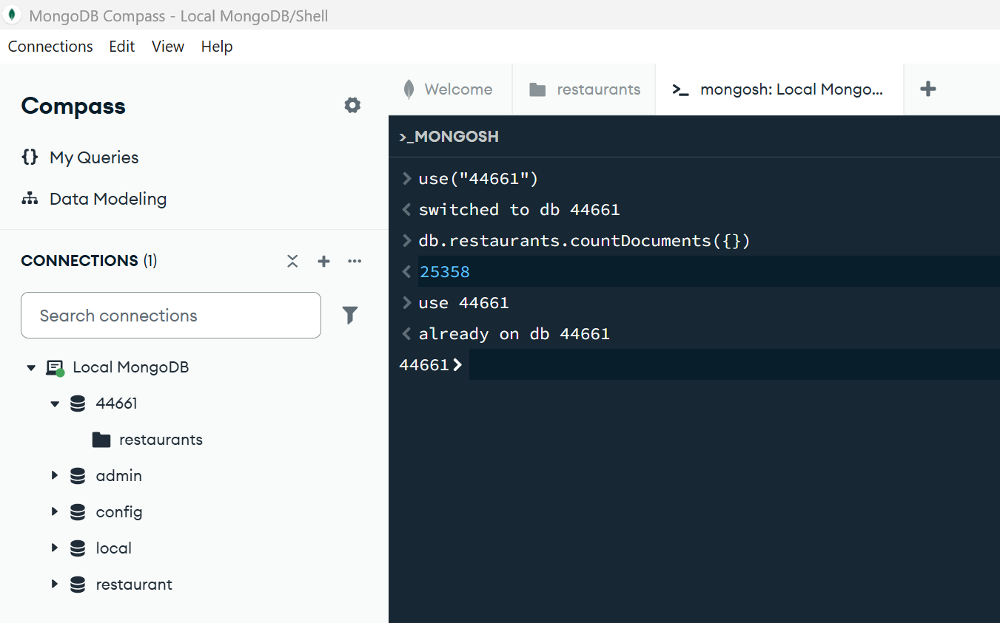
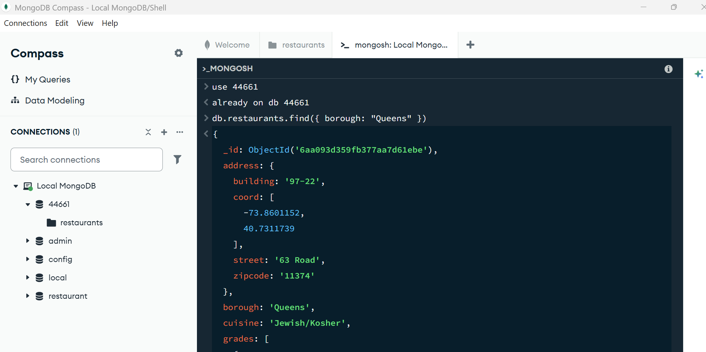
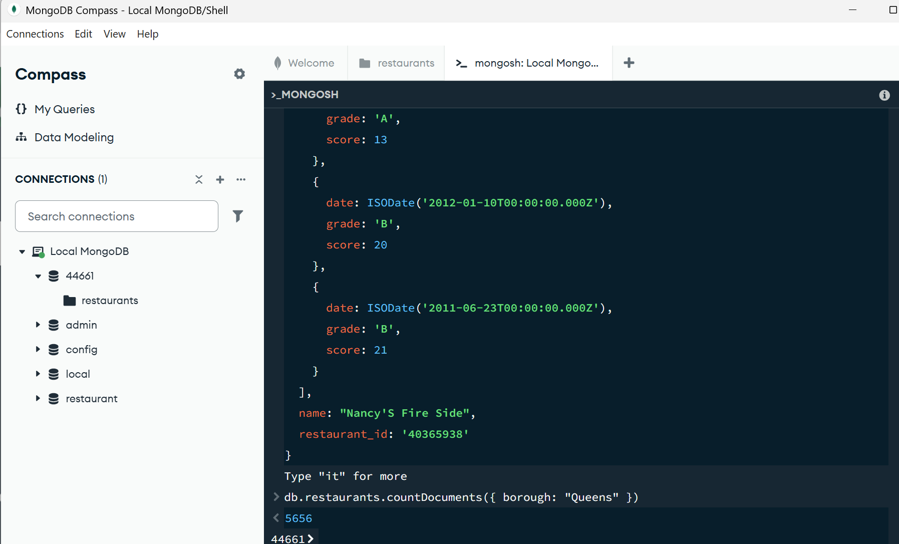
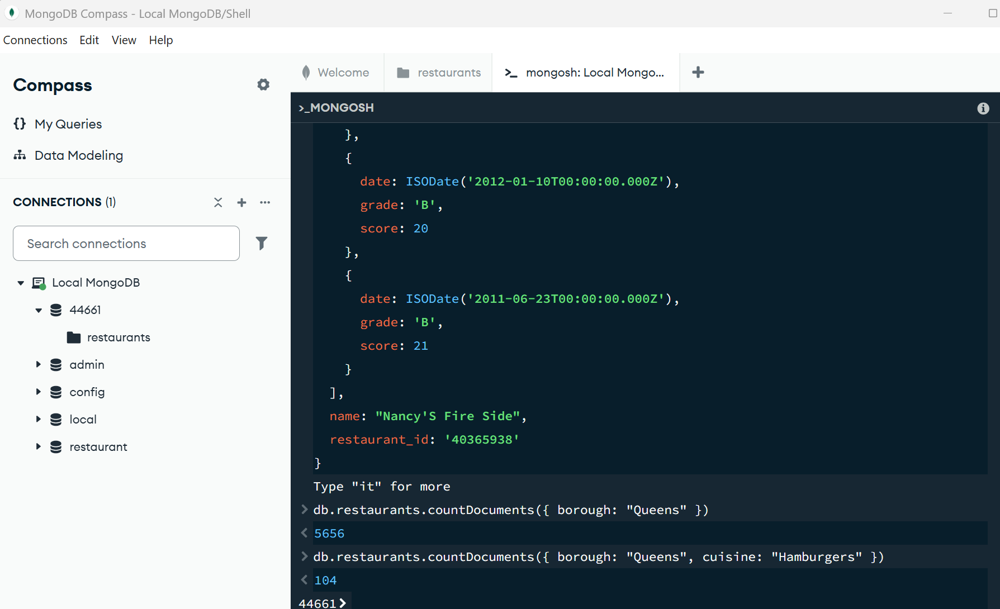
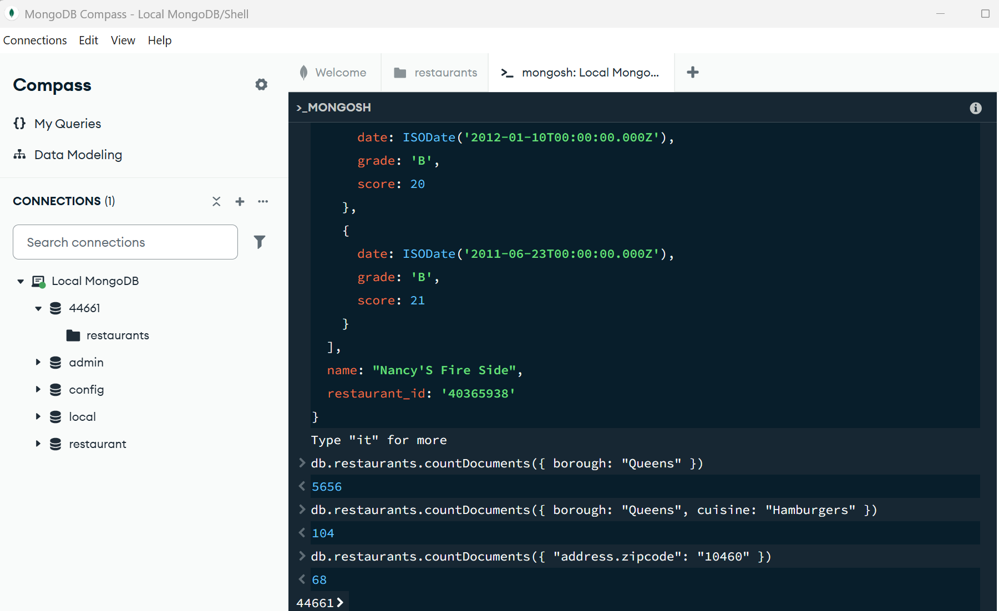
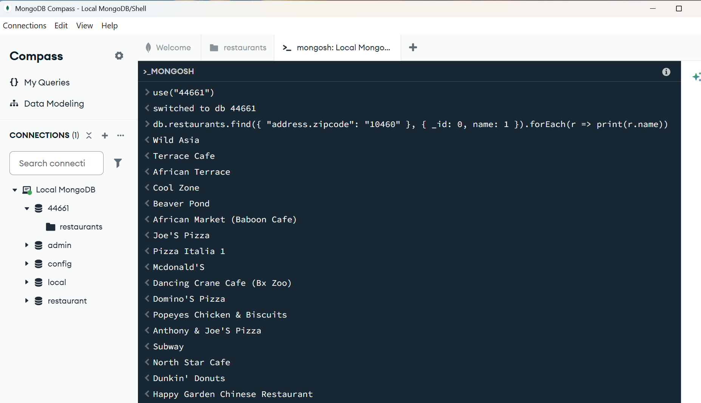
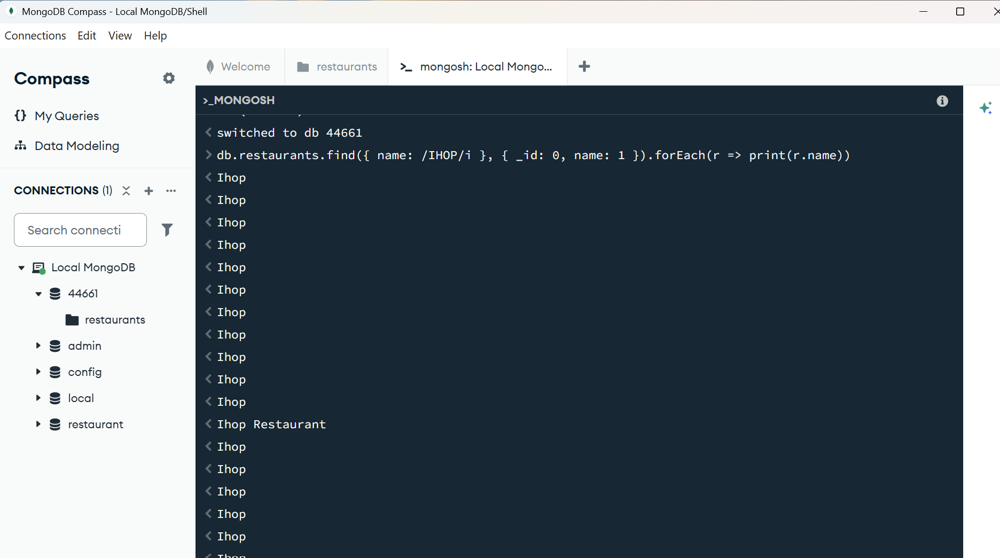

# Exercise 03: MongoDB – Document Queries and Analysis

- Name: Angie Crews
- Course: Database for Analytics
- Module: 3
- Database Used: MongoDB
- Dataset: `restaurants-json.json`

---

## Instructions

- Import the provided `restaurants-json.json` file into MongoDB.
- All commands must be **executed by you** in the MongoDB shell or MongoDB Compass.
- For each query:
  - Include the MongoDB command in a fenced code block
  - Include a **screenshot** showing the command and its result
- Store screenshots in the `screenshots/` folder and embed them below each answer.

---

## Question 1

When importing the documents from `restaurants-json.json`,
**how many documents were imported into your collection**?

### Answer

Number of documents imported = 25,358

### Screenshot

```javascript
db.restaurants.countDocuments({})
```
<u>**Query Note**</u>: countDocuments({}) counts all documents in the collection. The empty {} means no filter is applied, so every restaurant document is counted.



---

## Question 2

Before writing queries on the data,
**what command** do you use to set the
**MongoDB shell to operate on the `44661` database**?

### MongoDB Command

```javascript
use 44661
```

### Screenshot



---

## Question 3

Using your `restaurants` collection in the `44661` database,
write the MongoDB query needed to
**locate all documents in the `"Queens"` borough**.

### MongoDB Query

```javascript
db.restaurants.find({ borough: "Queens" })
```
<u>**Query Note**</u>: The find() method retrieves documents that match the filter. Here, { borough: "Queens" } limits the results to restaurants located in Queens.

### Screenshot



---

## Question 4

Using your `restaurants` collection in the `44661` database,
write the MongoDB query needed to
**find the number of restaurants in the `"Queens"` borough**.

### MongoDB Query

```javascript
db.restaurants.countDocuments({ borough: "Queens" })
```
<u>**Query Note**</u>: countDocuments() can also count only documents that meet a condition. Adding { borough: "Queens" } counts only restaurants in Queens.

### Screenshot



---

## Question 5

Using your `restaurants` collection in the `44661` database,
write the MongoDB query needed to
**find the number of restaurants** in the `"Queens"` borough
**whose cuisine is `"Hamburgers"`**.

### MongoDB Query

```javascript
db.restaurants.countDocuments({ borough: "Queens", cuisine: "Hamburgers" })
```
<u>**Query Note**</u>: Multiple field conditions inside the same filter work as an AND condition. A restaurant must have both borough: "Queens" and cuisine: "Hamburgers" to be counted.

### Screenshot



---

## Question 6

Using your `restaurants` collection in the `44661` database,
write the MongoDB query needed to
**find the number of restaurants in Zipcode `10460`**.


### MongoDB Query

```javascript
db.restaurants.countDocuments({ "address.zipcode": "10460" })
```
<u>**Query Note**</u>: **Embedded Documents** "address.zipcode" is in quotation marks because we're querying a nested field, and "10460" is also in quotation marks because the zipcode is stored as text in this dataset.

### Screenshot



---

## Question 7

Using your `restaurants` collection in the `44661` database,
write the MongoDB query needed to
**display only the names of restaurants in Zipcode `10460`**.

Your output should resemble:

```json
{ name: "Wild Asia" }
{ name: "Terrace Cafe" }
{ name: "African Terrace" }
{ name: "Cool Zone" }
{ name: "Beaver Pond" }
...
```

### MongoDB Query

```javascript
db.restaurants.find({ "address.zipcode": "10460" }, { _id: 0, name: 1 }).forEach(r => print(r.name))
```
<u>**Query Note**</u>: **Project Fields** The query uses "address.zipcode" to search the embedded address document for restaurants in Zipcode 10460, and the projection limits the results to restaurant names. I added .forEach(r => print(r.name)) to print each restaurant name on its own line and remove the extra spacing from the standard MongoDB shell output.

### Screenshot



---

## Question 8

Using your `restaurants` collection in the `44661` database,
write the MongoDB query needed to
**display only the names of restaurants whose name contains `"IHOP"`**,
ignoring case.

Your results should include:

- `"Ihop"`
- `"Ihop Restaurant"`

### MongoDB Query

```javascript
db.restaurants.find({ name: /IHOP/i }, { _id: 0, name: 1 }).forEach(r => print(r.name))
```
<u>**Query Note**</u>: The /IHOP/i regular expression searches for restaurant names containing "IHOP" while ignoring capitalization, and the projection displays only the restaurant name. To make the results easier to read without the extra spacing, .forEach(r => print(r.name)) can be added to print each matching name on a single line.

### Screenshot


