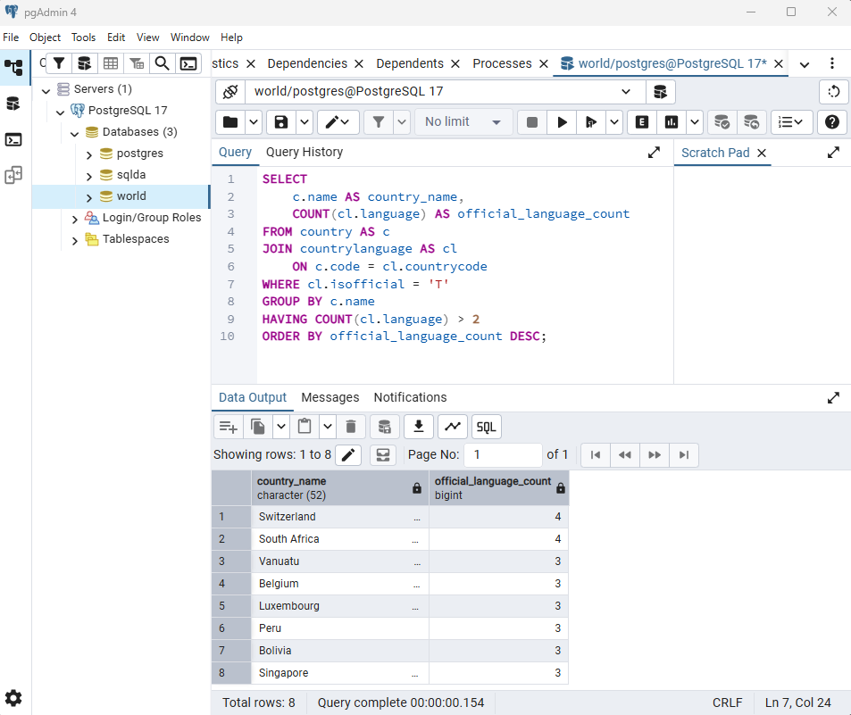
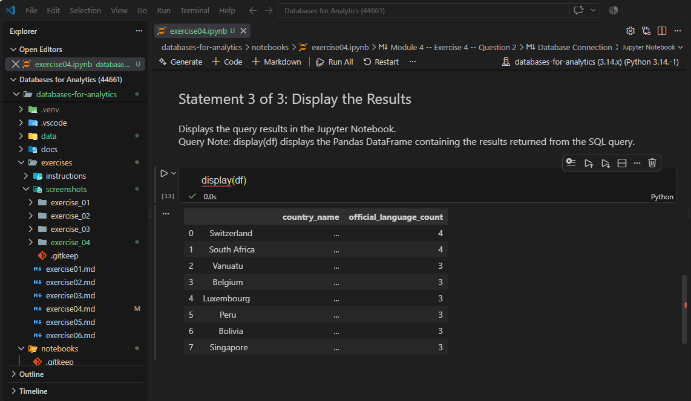
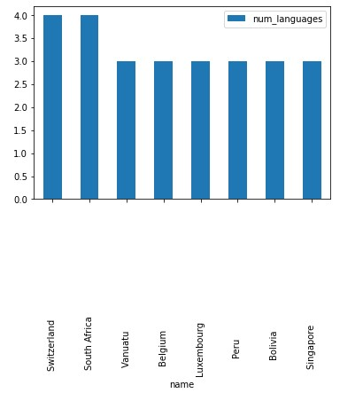
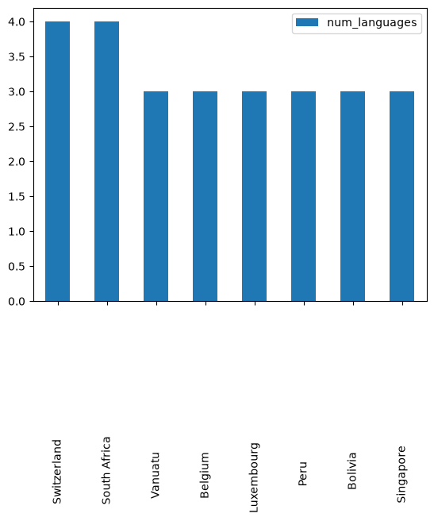

# Exercise 04: Advanced SQL, Jupyter, and Visualization

- Name: Angie Crews
- Course: Database for Analytics
- Module: 4
- Database Used: World Database
- Tools Used: PostgreSQL, SQLAlchemy, Pandas, Jupyter Notebooks

---

## Instructions

- Complete each task using the **World database** installed earlier.
- For SQL questions:
  - Write the SQL command in a fenced code block
  - Execute the command and include a **screenshot of the results**
- For Jupyter Notebook questions:
  - Include the required Python statements
  - Include **screenshots of the notebook output**
- Store all screenshots in the `screenshots/` folder and embed them below each question.

---

## Question 1

Considering the World database, write a SQL statement that will
**display the names of countries**
that speak **more than two official languages**,
along with the **number of official languages spoken**.

- Sort the results by **number of languages**, from **most to least**.
- _Hint: There are fewer than 10 countries in the results._

### SQL

```sql
SELECT
    c.name AS country_name,
    COUNT(cl.language) AS official_language_count
FROM country AS c
JOIN countrylanguage AS cl
    ON c.code = cl.countrycode
WHERE cl.isofficial = 'T'
GROUP BY c.name
HAVING COUNT(cl.language) > 2
ORDER BY official_language_count DESC;
```
### Query Note:
WHERE filters for official languages before grouping, while HAVING filters the grouped results to countries with more than two official languages. In this database, 'T' represents an official language.

### Screenshot



---

## Question 2

Using **Jupyter Notebooks**, you must use the
`create_engine` command to connect to your database.

After the `create_engine` command is executed,
**what are the three statements** required to
execute the query from Question 1 and
**display the results in the notebook**?
### Jupyter Notebook

[View Exercise 04 Notebook](../notebooks/exercise04.ipynb)

### Python Code

```python
query = """
SELECT
    c.name AS country_name,
    COUNT(cl.language) AS official_language_count
FROM country AS c
JOIN countrylanguage AS cl
    ON c.code = cl.countrycode
WHERE cl.isofficial = 'T'
GROUP BY c.name
HAVING COUNT(cl.language) > 2
ORDER BY official_language_count DESC;
"""

df = pd.read_sql(query, engine)

display(df)
```

### Screenshot



---

## Question 3

Using **Jupyter Notebooks**, write the Python code needed
to produce the following graph:



(The graph shows country-level results derived from the World database.)

### Jupyter Notebook

[View Exercise 04 Notebook](../notebooks/exercise04.ipynb)

### Python Code

```python
graph_df = df.rename(
    columns={"official_language_count": "num_languages"}
)

ax = graph_df.plot(
    kind="bar",
    x="country_name",
    y="num_languages"
)

ax.set_xlabel("")
plt.show()
```

### Screenshot


