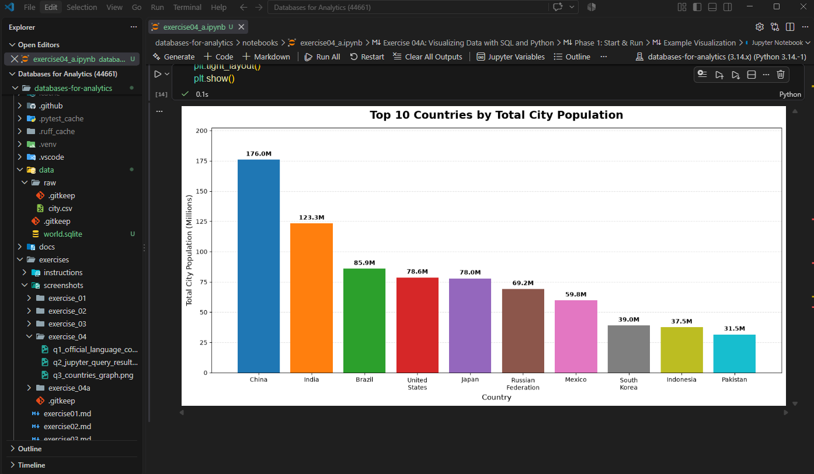
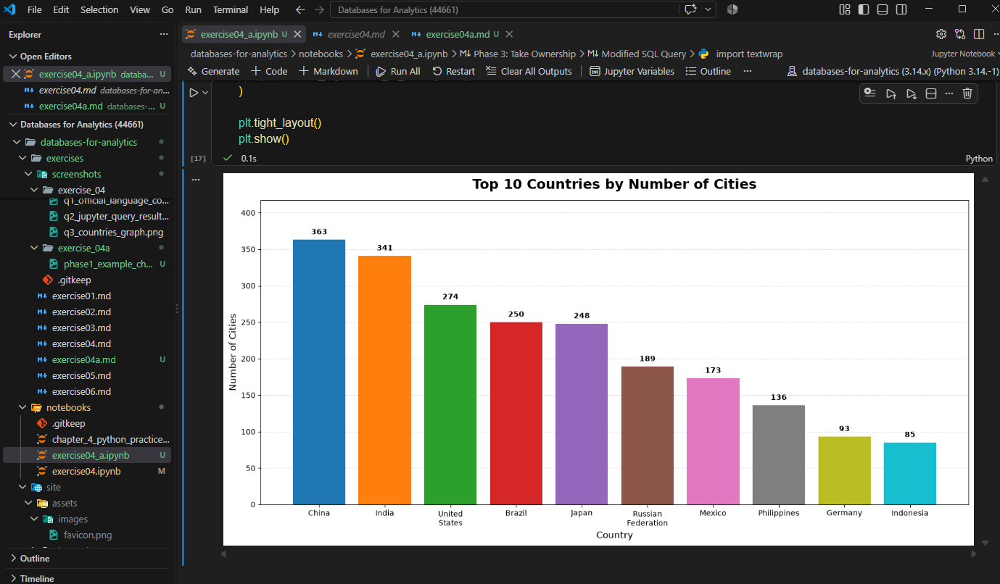

# Exercise 04A: Visualizing Data with SQL and Python

- Name: Angie Crews
- Course: Database for Analytics
- Module: 4
- Database Used: World Database (SQLite)
- Tools Used: SQLite, SQL, Pandas, Python, Matplotlib, Jupyter Notebooks

---

## Jupyter Notebook

[View Exercise 04A Notebook](../notebooks/exercise04_a.ipynb)

---

# Phase 1: Start & Run

## 1. Clone/setup/run the example. Confirm successful execution.

The existing Database for Analytics repository was already cloned and set up. I created a SQLite version of the World database from the existing PostgreSQL World database and successfully ran the SQL query and visualization in Jupyter Notebook.

## 2. Display screenshot showing the project running and/or resulting chart.



---

# Phase 2: Read & Understand

## 1. Describe the database, the related tables, and what the SQL query does.

The World SQLite database contains information about countries, cities, and languages. The database includes the `country`, `city`, and `countrylanguage` tables. The SQL query uses the `country` and `city` tables to calculate the total city population for each country. It sorts the results from highest to lowest and returns the top 10 countries.

## 2. Explain the flow: SQLite -> SQL query -> pandas DataFrame -> visualization.

SQLite stores the World database. The SQL query retrieves and summarizes the data, Pandas loads the query results into a DataFrame, and Matplotlib uses the DataFrame to create the bar chart.

## 3. Describe the join.

The query uses an `INNER JOIN` to connect the `country` and `city` tables. It matches `country.code` with `city.countrycode`, allowing each city to be connected to its country.

## 4. Describe the grain of the result.

The grain is one row per country. Each row represents one country and its total population from the cities included in the World database.

---

# Phase 3: Take Ownership

## 1. Paste your modified SQL.

```sql
SELECT
    c.name AS country_name,
    COUNT(ci.id) AS number_of_cities
FROM country AS c
JOIN city AS ci
    ON c.code = ci.countrycode
GROUP BY c.name
ORDER BY number_of_cities DESC
LIMIT 10;
```

## 2. Display a screenshot of the resulting chart.



## 3. Briefly explain what question the new query answers.

The modified query answers which 10 countries have the greatest number of cities represented in the World database. It counts the cities for each country and sorts the results from highest to lowest.

## 4. What challenges did you encounter?

One challenge was that the existing World database was in PostgreSQL, while this exercise used SQLite. I also needed to make the chart easy to read, especially with longer country names.

## 5. How did you address the challenges?

I used Pandas and SQLAlchemy to copy the World database tables from PostgreSQL into a SQLite database. I also adjusted the Matplotlib chart by adding data labels, using different colors, and wrapping longer country names so the results were easier to read.

## 6. Paste a clickable link to your project if you can git add, commit, and push it back to GitHub (hit ENTER after pasting):

https://github.com/Angie-Crews/databases-for-analytics/blob/main/exercises/exercise04a.md
