# Exercise 05: SQLDA Database - Dates, Data Quality, Arrays, and JSON

- Name: Angie Crews
- Course: Database for Analytics
- Module: 5
- Database Used: `sqlda` (Sample Datasets)
- Tools Used: PostgreSQL (pgAdmin or psql)

---

## Instructions

- Use the **sqlda** database from the "Loading the Sample Datasets" instructions.
- For each SQL task:
  - Include your SQL in a fenced code block
  - Execute it and include a **screenshot** showing the query and results
- Store screenshots in the `screenshots/` folder and embed them below each answer.
- For explanation questions:
  - Write your answer in complete sentences
  - Include a screenshot if requested

---

## Question 1

Using the `sqlda` database, write the SQL needed
to show a **list of years** that emails were sent.

Your results should list years like this (order matters):

```text
year
2011
2013
2014
2015
2016
2017
2018
2019
```

### SQL

```sql

SELECT DISTINCT
    EXTRACT(YEAR FROM sent_date)::INTEGER AS year
FROM emails
WHERE sent_date IS NOT NULL
ORDER BY year;

```
**Query Note:** This query extracts the year from each email's sent date. I used DISTINCT to remove duplicate years and ORDER BY to display them from oldest to newest. My results returned eight unique years, ranging from 2013 to 2021.

### Screenshot

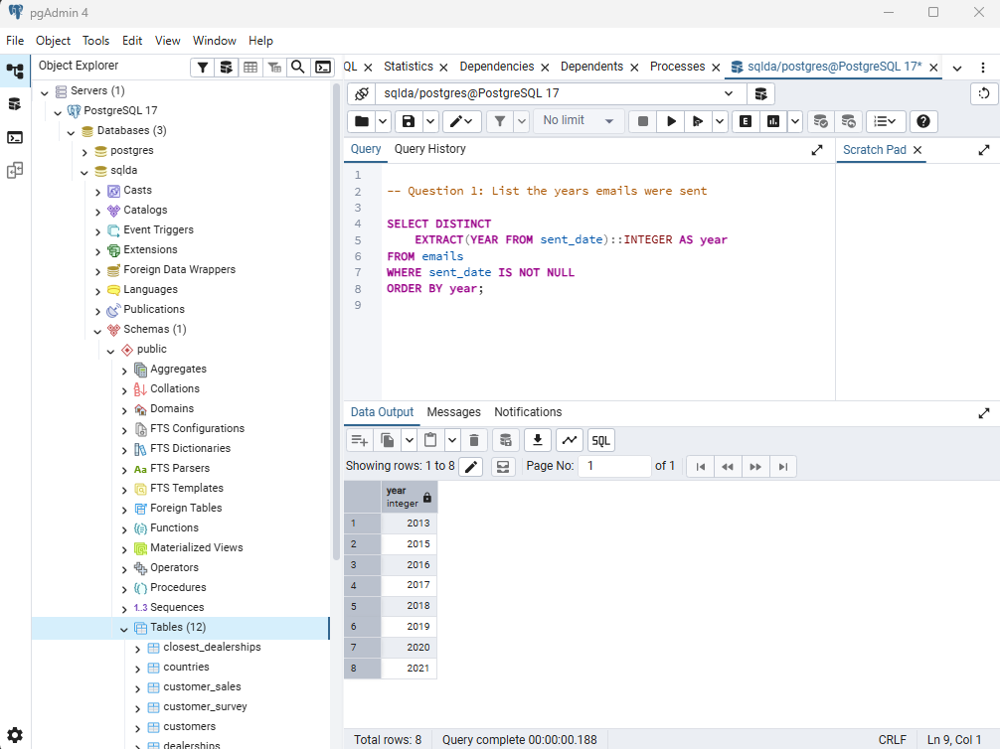

---

## Question 2

Using the `sqlda` database, write the SQL needed to
show the **number of messages sent by year**,
ordered by year (as shown in the prompt).

Output should resemble:

```text
count   year
...
```

### SQL

```sql

-- Question 2: Count messages sent by year

SELECT
    COUNT(*) AS count,
    EXTRACT(YEAR FROM sent_date)::INTEGER AS year
FROM emails
WHERE sent_date IS NOT NULL
GROUP BY year
ORDER BY year;

```
**Query Note:** This query groups emails by the year they were sent and uses COUNT(*) to calculate the number of messages for each year. I used ORDER BY to display the results chronologically. The results show that 2019 had the highest number of emails sent, with 107,847 messages.

### Screenshot

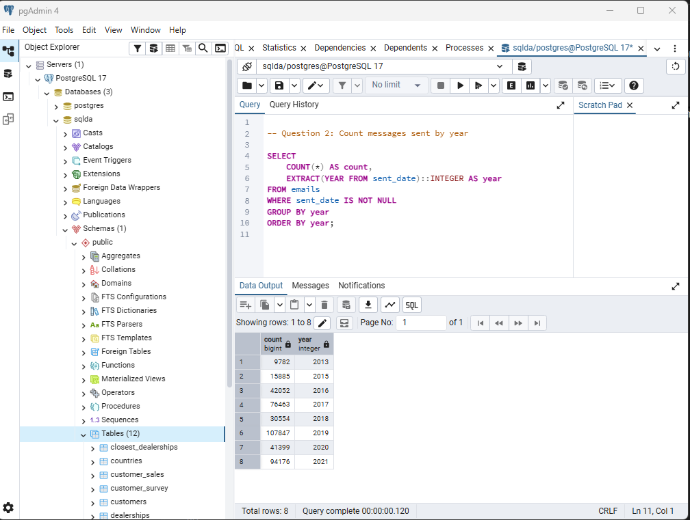

---

## Question 3

Using the `sqlda` database, write the SQL needed to show:

- the **sent date**
- the **opened date**
- the **interval** between the two

Only include emails that contain **both** a sent date and an opened date.

### SQL

```sql
-- Question 3: Calculate the interval between sent and opened dates

SELECT
    sent_date,
    opened_date,
    opened_date - sent_date AS time_interval
FROM emails
WHERE sent_date IS NOT NULL
    AND opened_date IS NOT NULL;
```

**Query Note:** This query calculates the time between when an email was sent and when it was opened. I excluded records with missing dates so the interval could be calculated. The query returned 83,579 records and can also help identify unusual records where an email appears to have been opened before it was sent.

### Screenshot

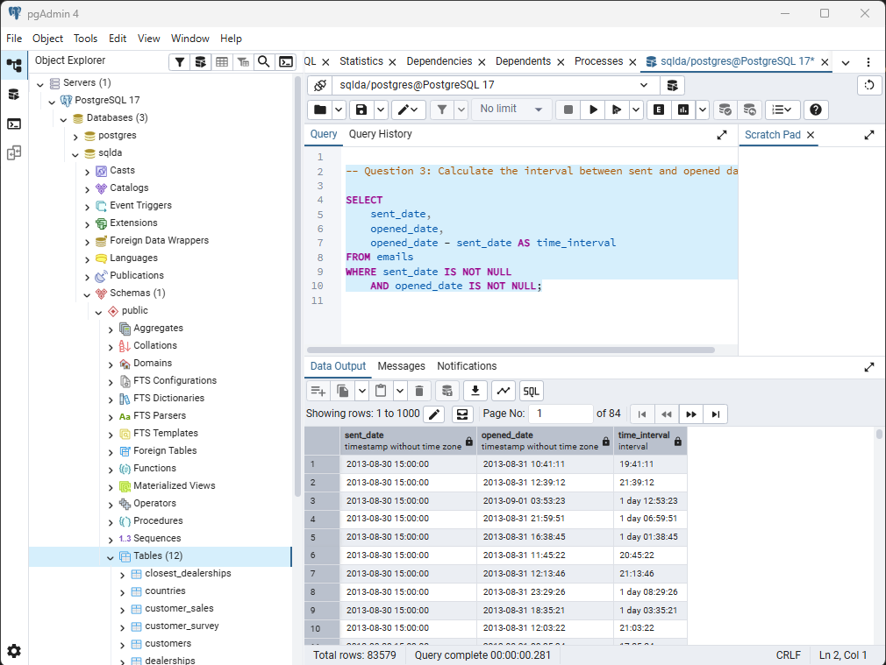

---

## Question 4

Using the `sqlda` database,
write the SQL needed to
show emails that contain an **opened date BEFORE the sent date**.

### SQL

```sql

-- Question 4: Find emails opened before they were sent

SELECT
    sent_date,
    opened_date,
    opened_date - sent_date AS time_interval
FROM emails
WHERE sent_date IS NOT NULL
    AND opened_date IS NOT NULL
    AND opened_date < sent_date
ORDER BY sent_date;

```
**Query Note:** This query identifies emails that appear to have been opened before they were sent. I compared the opened date with the sent date and calculated the time difference. The query returned 109 records with negative intervals, indicating a possible data quality issue.

### Screenshot

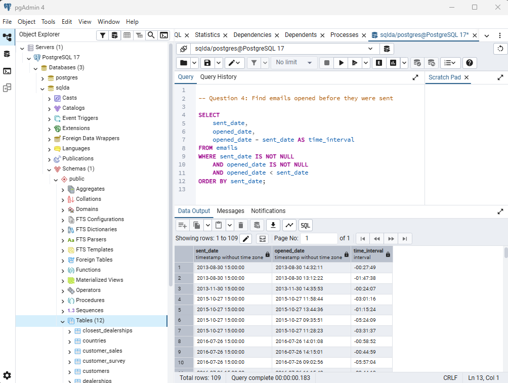

---

## Question 5

Using the `sqlda` database:
there are **over 100 emails**
that contain an opened date **BEFORE** the sent date.

After looking at the data, **why is this the case?**

### Answer

**Answer:** After reviewing the data, I found 109 emails with an opened date earlier than the sent date. I ran an additional query and confirmed that all 109 emails had a sent timestamp of exactly 3:00 PM, while the opened times varied. This suggests a possible issue with how the timestamps were recorded or converted, such as a time zone difference or a default time being applied. The negative intervals indicate a data quality issue that should be investigated before using the data for analysis.

### SQL

```sql

-- Question 5: Investigate unusual sent times

SELECT
    sent_date::TIME AS sent_time,
    COUNT(*) AS email_count
FROM emails
WHERE opened_date < sent_date
GROUP BY sent_date::TIME
ORDER BY email_count DESC;

```

### Screenshot (if requested by instructor)

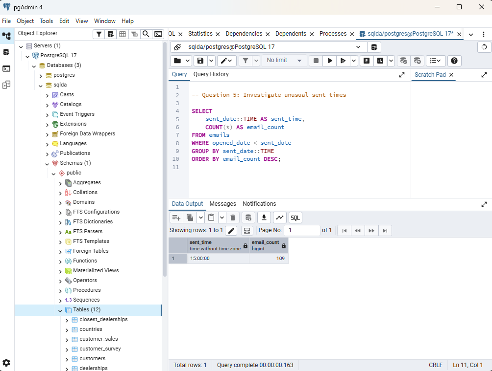

---

## Question 6

Using the `sqlda` database, explain in your own words what the following code does:

```sql
CREATE TEMP TABLE customer_points AS (
    SELECT
        customer_id,
        point(longitude, latitude) AS lng_lat_point
    FROM customers
    WHERE longitude IS NOT NULL
    AND latitude IS NOT NULL
);

CREATE TEMP TABLE dealership_points AS (
    SELECT
        dealership_id,
        point(longitude, latitude) AS lng_lat_point
    FROM dealerships
);

CREATE TEMP TABLE customer_dealership_distance AS (
    SELECT
       customer_id,
       dealership_id,
       c.lng_lat_point <@> d.lng_lat_point AS distance
    FROM customer_points c
    CROSS JOIN dealership_points d
);
```

### Answer

**Answer:**
This SQL creates three temporary tables to calculate the distance between customers and dealerships.
The first table stores customer IDs and their geographic coordinates, excluding customers with missing latitude or longitude.
The second table stores dealership IDs and their coordinates.
The third table uses a CROSS JOIN to match every customer with every dealership and calculates the distance between their locations in miles.
This information could help identify which dealerships are closest to each customer.

---

## Question 7

Using the `sqlda` database,
write SQL to display an
**array of salespeople for each dealership**,
sorted by dealership.

For example - dealership 1 is below:

```text
"{""Fidell,Granville"",""Onele,Jereme"",""Sheriff,Lelia"",""McSpirron,Massimiliano"",""Rennick,Nadia"",""Mace,Eveleen"",""Oxteby,Dukie"",""Spong,Marcos"",""Wogden,Quent"",""Duny,Sandye"",""Loraine,Englebert"",""Meere,Ira"",""Gibbens,Cristine"",""Prine,Lyda"",""McCoughan,Sheff"",""Schule,Giselbert"",""McAndie,Eleen"",""Dosedale,Dorie"",""Nafziger,Shay""}"
```

### SQL

```sql

-- Question 7: Array of salespeople by dealership

SELECT
    dealership_id,
    ARRAY_AGG(last_name || ',' || first_name) AS salespeople
FROM salespeople
GROUP BY dealership_id
ORDER BY dealership_id;

```

**Query Note:** This query groups salespeople by dealership and uses ARRAY_AGG() to combine their names into a single array. I joined each salesperson's last and first name with a comma and sorted the results by dealership ID. The query returned 20 dealerships.


### Screenshot

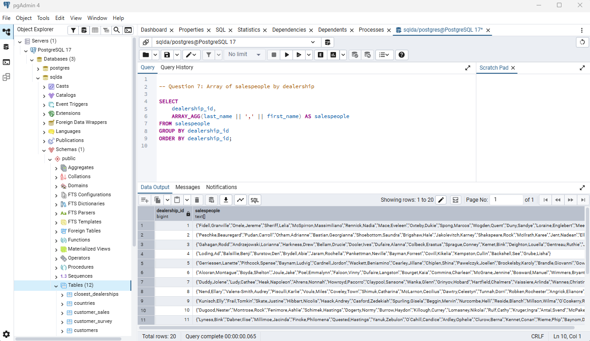

---

## Question 8

Using the `sqlda` database, write SQL to display:

- an **array of salespeople for each dealership**
- the **state** of the dealership
- the **number of salespeople** for the dealership

Sort by **state**.

Reference image:

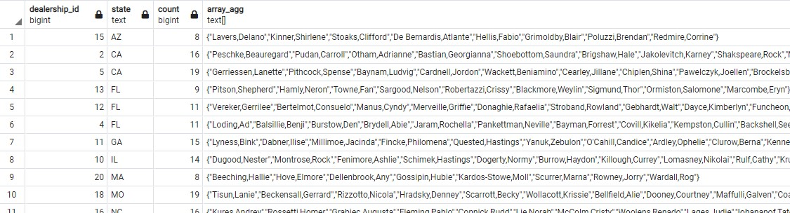

### SQL

```sql

-- Question 8: Salespeople array, state, and count

SELECT
    d.dealership_id,
    d.state,
    ARRAY_AGG(s.last_name || ',' || s.first_name) AS salespeople,
    COUNT(s.salesperson_id) AS salesperson_count
FROM dealerships d
JOIN salespeople s
    ON d.dealership_id = s.dealership_id
GROUP BY
    d.dealership_id,
    d.state
ORDER BY d.state;

```

**Query Note:** This query joins the dealerships and salespeople tables using dealership_id. I used ARRAY_AGG() to combine the salespeople's names into an array and COUNT() to calculate the number of salespeople at each dealership. The results returned 20 dealerships, grouped by dealership and state, and sorted alphabetically by state.


### Screenshot

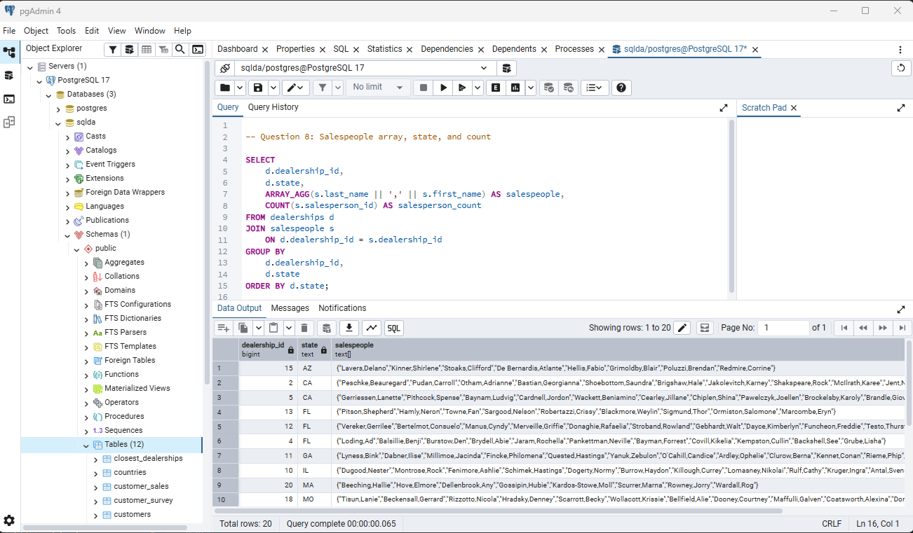

---

## Question 9

Using the `sqlda` database, write the SQL needed to convert
the **customers** table to **JSON**.

### SQL

```sql

-- Question 9: Convert customers table to JSON

SELECT
    ROW_TO_JSON(c) AS customer_json
FROM customers c;

```

**Query Note:** This query uses ROW_TO_JSON() to convert each customer record into a JSON object. The column names become JSON keys, and the customer information becomes the corresponding values. The query returned 50,000 customer records in JSON format.


### Screenshot

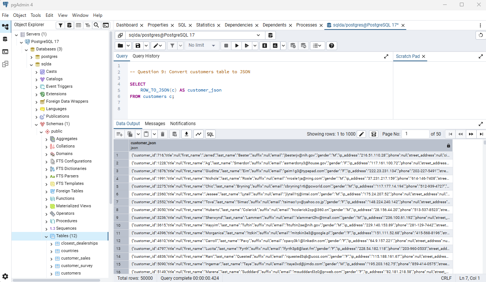

---

## Question 10

Using the `sqlda` database, write SQL to display:

- an **array of salespeople for each dealership**
- the **state**
- the **number of salespeople**
- sorted by **state**

Then **convert this result to JSON**.

Reference image:

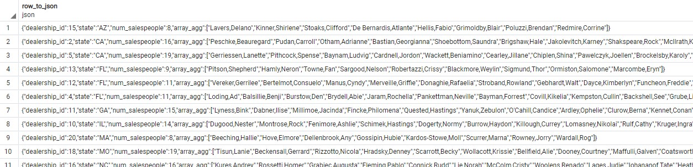

### SQL

```sql

-- Question 10: Convert salespeople arrays to JSON

SELECT
    ROW_TO_JSON(t) AS dealership_json
FROM (
    SELECT
        d.dealership_id,
        d.state,
        ARRAY_AGG(s.last_name || ',' || s.first_name) AS salespeople,
        COUNT(s.salesperson_id) AS salesperson_count
    FROM dealerships d
    JOIN salespeople s
        ON d.dealership_id = s.dealership_id
    GROUP BY
        d.dealership_id,
        d.state
    ORDER BY d.state
) t;

```

**Query Note:** This query combines dealership information, salesperson arrays, and salesperson counts into JSON format. I used ARRAY_AGG() to group the names, COUNT() to calculate the number of salespeople, and ROW_TO_JSON() to convert each dealership's results into a JSON object. The query returned 20 dealership records sorted alphabetically by state.


### Screenshot

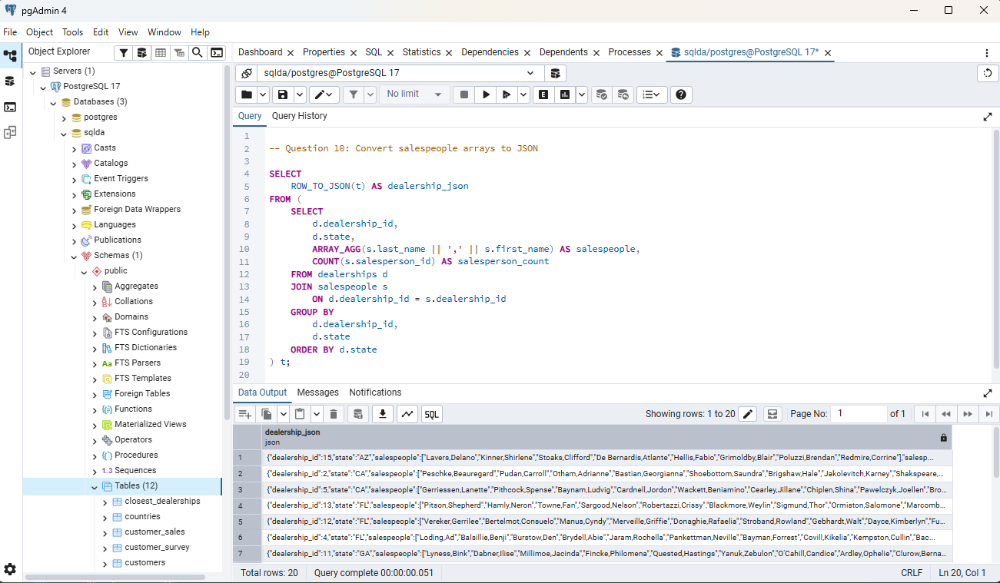
