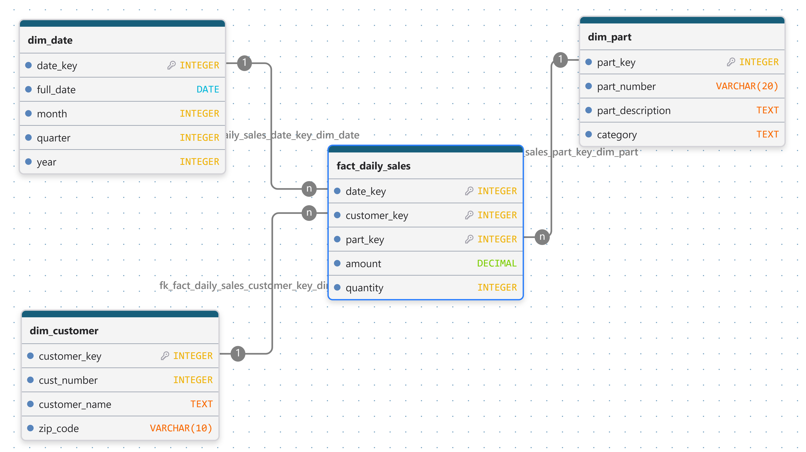

# Module 6 - Exercise 1: Creating a Data Warehouse

From the Operational Model to the Dimensional Model

- Name: Angie Crews
- Course: Database for Analytics
- Module: 6

---

## Overview

In this exercise you will design a **dimensional (star schema) model**
for a data warehouse based on an **operational sales database**.

- **Business process:** Customer Sales
- **Grain:** Daily sales
- **Facts to store (only):**
  - **amount** = daily sales total amount (revenue)
  - **quantity** = daily sales total quantity (units sold)

You will determine the dimensions needed to support the required analytics.

---

## Operational Database Summary (Source System)

Tables in the operational model include:

- `customer` (custNumber, custName, address, currBal, credLimit, repNum)
- `parts` (partNum, partDesc, category, unitsOnHand, warehouseNum, unitPrice)
- `slsrep` (repNum, repName, repAddress, totComm, commRate)
- `orders` (orderNum, orderDate, custNum)
- `orderline` (orderNum, partNum, numOrdered)

---

## Analytics Requirements (What the Warehouse Must Support)

Your dimensional model must support questions such as:

- How many of part number **ax12** were sold on **September 2, 1994**?
- How many of part number **ax12** did customer **124** purchase last year?
- How much did customer **124** spend last year?
- What was the **average amount spent per customer per day** during September 1994?
- What was the **average quantity sold of part ax12 per day** during September 1994?
- What was the **average daily sales** during the third quarter of 1994?
- How many **appliance** items were sold during the third quarter of 1994?
- What was the amount of revenue generated by customers in
  **zip code 64468** during September 1994?

### Analytics Requirements Mapping

The following table shows how the dimensional model supports each required business question.

| # | Business Question | Dimension Fields Used | Fact Field | Analysis |
|---|---|---|---|---|
| 1 | How many units of part ax12 were sold on September 2, 1994? | part_number, full_date | quantity | Sum quantity for the selected part and date. |
| 2 | How many units of part ax12 did customer 124 purchase last year? | part_number, cust_number, year | quantity | Sum quantity for the customer, part, and year. |
| 3 | How much did customer 124 spend last year? | cust_number, year | amount | Sum the customer's sales amount for the year. |
| 4 | What was the average amount spent per customer per day during September 1994? | customer_key, full_date | amount | Calculate daily customer totals, then average them. |
| 5 | What was the average quantity sold of part ax12 per day during September 1994? | part_number, full_date | quantity | Calculate daily quantities and average them across the month. |
| 6 | What was the average daily sales during Q3 1994? | quarter, year, full_date | amount | Calculate daily revenue totals and average them. |
| 7 | How many appliance items were sold during Q3 1994? | category, quarter, year | quantity | Sum quantity for the appliance category during the quarter. |
| 8 | How much revenue came from customers in zip code 64468 during September 1994? | zip_code, full_date | amount | Sum revenue for the selected zip code and month. |

---

## Out of Scope

We do **not** care about:

- Questions about **specific orders** (order-level reporting)
- Questions about **sales reps**
- Questions about **credit limits, balances**, or other customer finance fields
- Inventory questions (warehouseNum, unitsOnHand, etc.)

---

## Key Design Constraints

- The warehouse must be a **star schema**.
- The fact table must store only:
  - `amount`
  - `quantity`
- Data must be **aggregated as necessary from the operational database before loading**.
- The grain is **daily sales** (not per order, not per orderline).

---

## Your Task

### Step 1: Design the Star Schema

Create a dimensional model that includes:

- One **fact table** (daily customer sales facts)
- Appropriate **dimension tables** (you decide which ones are necessary)

Your model must clearly show:

- Fact table name and fields
- Dimension table names and fields
- Primary keys and foreign keys
- Relationships (dimensions connect to the fact table)

---

## Deliverables

### 1) Star Schema Diagram (Required)

Create and submit a **diagram** of your star schema.

You may use any tool, such as:

- draw.io (diagrams.net)
- PowerPoint
- Google Drawings
- Lucidchart
- Hand-drawn on paper (then take a clear photo)

Save your diagram image in this repo and embed it below.

**File name suggestion:** `star-schema.png` or `star-schema.jpg`

#### Diagram

---

### 2) Design Notes (Required)

In 1-2 short paragraphs, explain:

- What dimensions you chose and why
- Why your fact table grain is daily sales
- How your design supports at least 3 of the required analytics questions

#### Design Notes

**1. Dimensions Selected**

I chose three dimensions: date, customer, and part. The date dimension supports analysis by day, month, quarter, and year. The customer dimension provides customer information and zip code, while the part dimension includes part numbers, descriptions, and categories. These dimensions allow sales to be analyzed from different perspectives without including unnecessary operational data.

**2. Fact Table and Grain**

The `fact_daily_sales` table stores the total sales amount and quantity for each date, customer, and part combination. Sales are aggregated before being loaded into the warehouse, rather than storing individual orders or order lines. This keeps the warehouse focused on daily sales analysis.

**3. Supported Analytics**

The design supports the required analytics, including:

- Quantity of a specific part sold on a particular date.
- Total amount spent by a customer during a year.
- Average daily sales during a month or quarter.
- Quantity sold by product category.
- Revenue generated by customers in a specific zip code.
