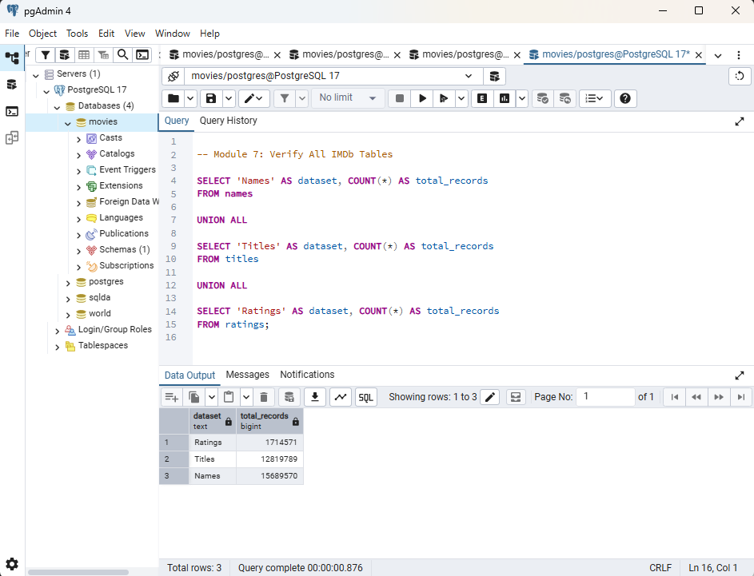
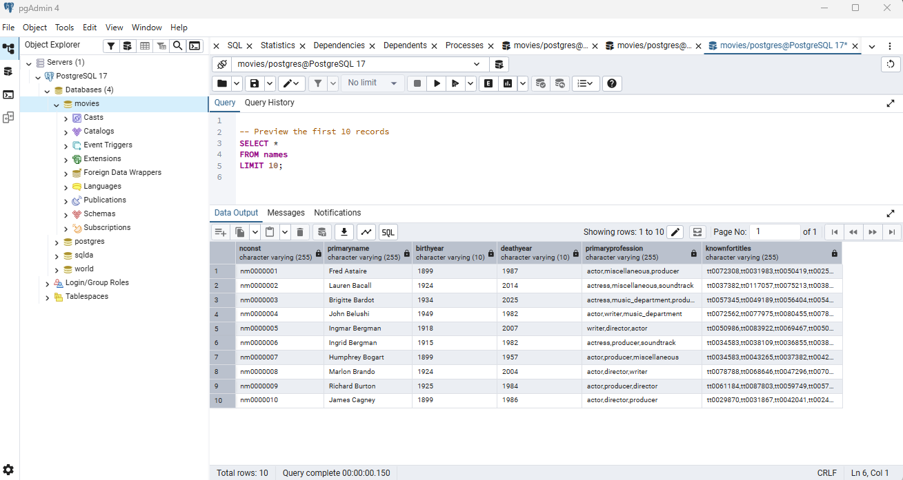
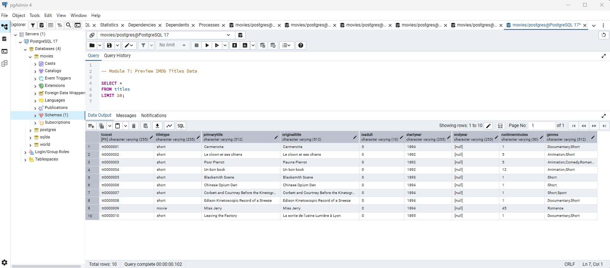
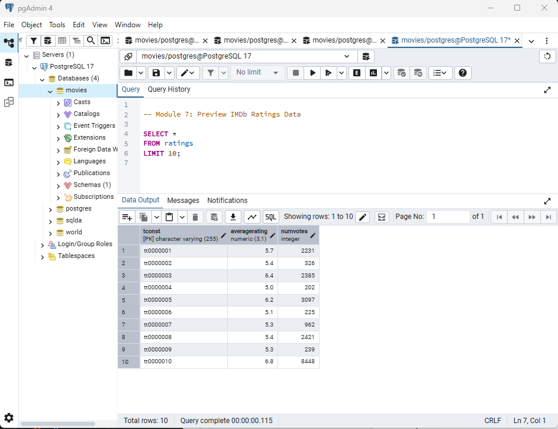
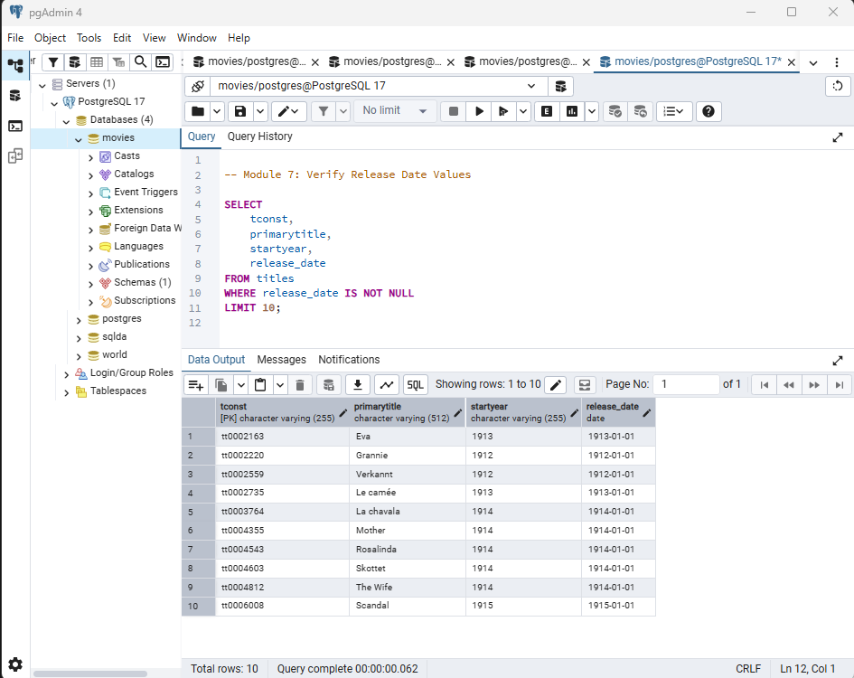
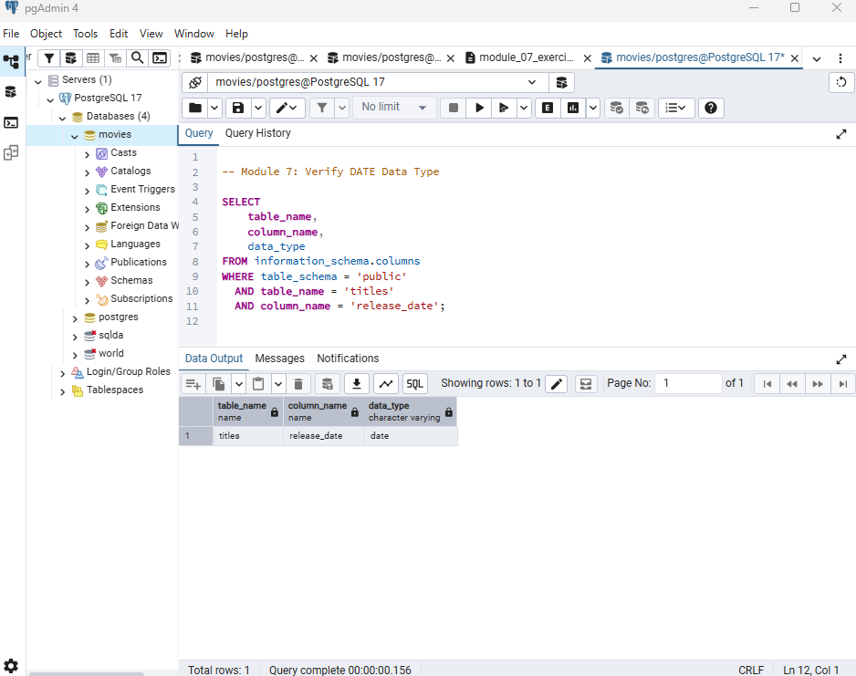
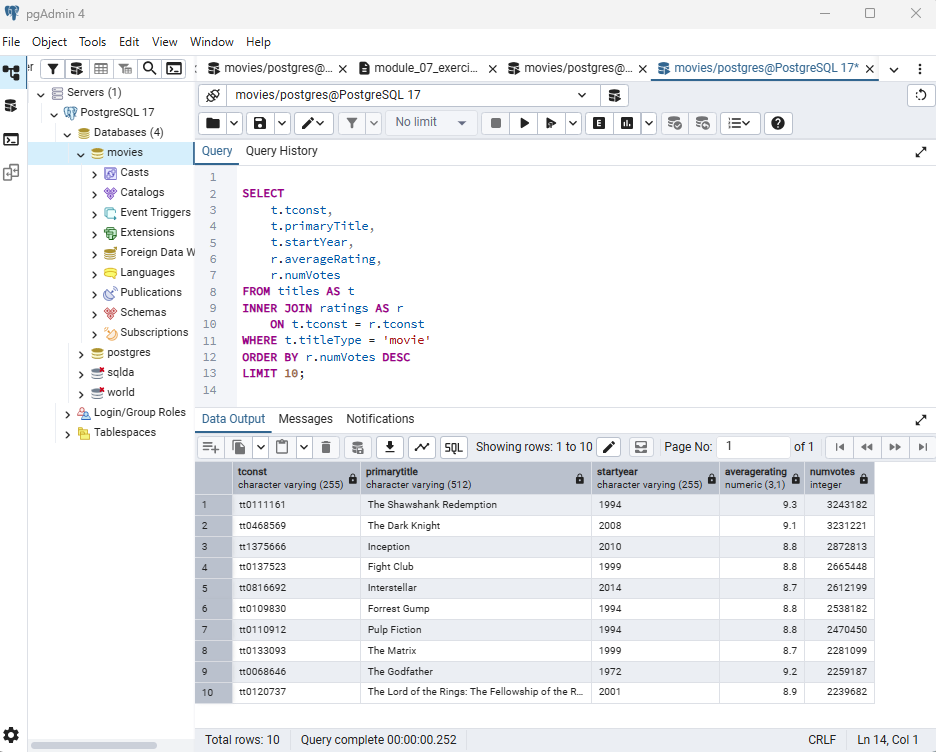
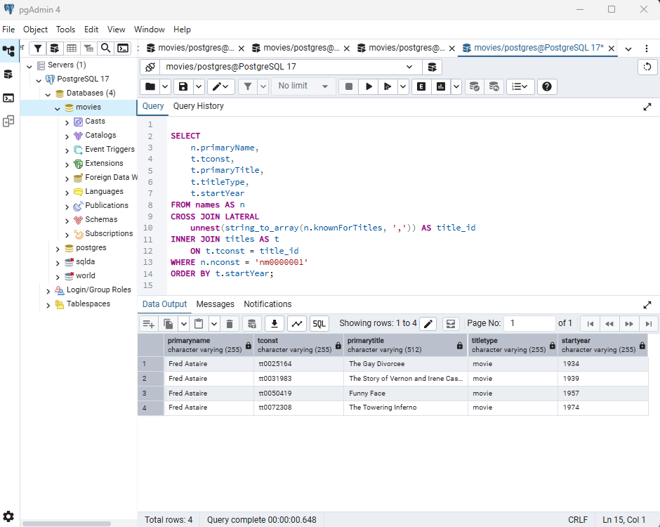
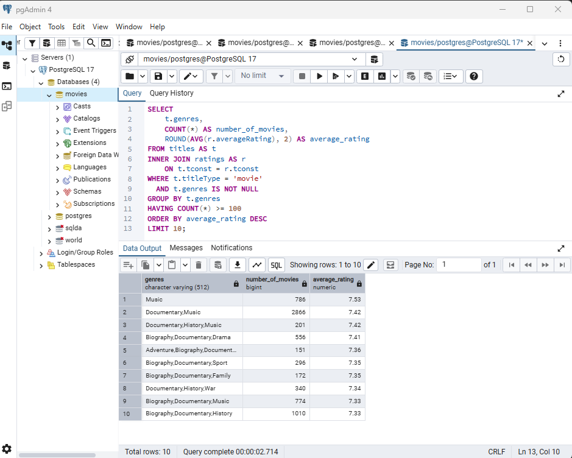

# Final Project – Building and Exploring an IMDb Database

**Name:** Angie Crews
**Module:** 7 – Locating, Installing, and Verifying Data
**Database:** IMDb Movies Database
**Tools:** PostgreSQL 17, pgAdmin 4, SQL
**Operating System:** Windows 11 Pro

---

## 1. Project Overview

The purpose of this project is to locate, import, and explore a large dataset using PostgreSQL.

For this project, I selected the IMDb dataset and created a database named `movies`. I imported three datasets containing information about people, movie titles, and ratings.

The project includes:

- Creating database tables.
- Importing large TSV files into PostgreSQL.
- Verifying imported records.
- Reviewing and updating data types.
- Creating a DATE column.
- Exploring relationships between the datasets using SQL.

The goal is to build a database that supports data analysis and demonstrates the ability to work with large datasets.

---

## 2. Dataset Source

The datasets used for this project were downloaded from the official IMDb Non-Commercial Datasets website.

**Source:** https://datasets.imdbws.com/

The following datasets were selected:

| Dataset | Description |
|---|---|
| name.basics.tsv | Information about people in the entertainment industry, including names, birth years, death years, professions, and known titles. |
| title.basics.tsv | Information about movies and television titles, including title type, release year, runtime, and genres. |
| title.ratings.tsv | IMDb ratings and the number of votes received for each title. |

The files were downloaded in compressed `.tsv.gz` format and extracted before importing them into PostgreSQL.

### 2.1 Dataset Size and Format

| IMDb Dataset | Format | Rows | Columns |
|---|---|---:|---:|
| `name.basics.tsv.gz` | Compressed TSV | 15,689,570 | 6 |
| `title.basics.tsv.gz` | Compressed TSV | 12,819,789 | 9 |
| `title.ratings.tsv.gz` | Compressed TSV | 1,714,571 | 3 |

### 2.2 Data Dictionary

The following data dictionary describes the attributes included in the three IMDb datasets used for this project.

#### Names Dataset

| Attribute | Description |
|---|---|
| `nconst` | Unique IMDb identifier for a person. |
| `primaryName` | Name by which the person is most commonly known. |
| `birthYear` | Year the person was born. |
| `deathYear` | Year the person died, when available. |
| `primaryProfession` | Primary profession or professions associated with the person. |
| `knownForTitles` | IMDb title identifiers for titles the person is known for. |

#### Titles Dataset

| Attribute | Description |
|---|---|
| `tconst` | Unique IMDb identifier for a title. |
| `titleType` | Type of title, such as movie, short, or television series. |
| `primaryTitle` | Primary title used for the movie or program. |
| `originalTitle` | Original title of the movie or program. |
| `isAdult` | Indicates whether the title is classified as adult content. |
| `startYear` | Release year or starting year of the title. |
| `endYear` | Ending year for a television series, when applicable. |
| `runtimeMinutes` | Runtime of the title in minutes. |
| `genres` | Genre or genres associated with the title. |

#### Ratings Dataset

| Attribute | Description |
|---|---|
| `tconst` | IMDb title identifier that connects the rating to the corresponding title. |
| `averageRating` | Weighted average IMDb user rating for the title. |
| `numVotes` | Number of IMDb user votes used in the rating. |

---

## 3. Database Requirements

The database was created in PostgreSQL 17 using pgAdmin 4.

**Database Name:** `movies`

The project meets the following requirements:

- At least three database tables.
- One table containing more than 1,000 records.
- Two additional tables containing more than 100 records each.
- At least one DATE data type.
- At least one NUMERIC data type.
- At least one string data type.

The three IMDb datasets provide enough records to meet the minimum table requirements while allowing additional SQL analysis.

---

## 4. Database Setup and Table Creation

I created a PostgreSQL database named `movies` using pgAdmin 4.

Three tables were created to store the IMDb datasets.

### 4.1 Names Table

The `names` table stores information about people in the entertainment industry.

```sql
CREATE TABLE names (
    nconst VARCHAR(255),
    primaryName VARCHAR(255),
    birthYear VARCHAR(10),
    deathYear VARCHAR(10),
    primaryProfession VARCHAR(255),
    knownForTitles VARCHAR(255)
);
```

### 4.2 Titles Table

The `titles` table stores information about movies, television shows, and other IMDb titles.

```sql
CREATE TABLE titles (
    tconst VARCHAR(255) PRIMARY KEY,
    titleType VARCHAR(255),
    primaryTitle VARCHAR(512),
    originalTitle VARCHAR(512),
    isAdult VARCHAR(10),
    startYear VARCHAR(255),
    endYear VARCHAR(255),
    runtimeMinutes VARCHAR(50),
    genres VARCHAR(512)
);
```

### 4.3 Ratings Table

The `ratings` table stores IMDb ratings and vote counts.

```sql
CREATE TABLE ratings (
    tconst VARCHAR(255) PRIMARY KEY,
    averageRating NUMERIC(3,1),
    numVotes INTEGER
);
```

### Query Notes

- `VARCHAR` stores text values.
- `PRIMARY KEY` uniquely identifies each record.
- `NUMERIC(3,1)` stores ratings with one decimal place.
- `INTEGER` stores whole numbers, such as vote counts.
- The `tconst` field connects movie titles with their ratings.

The tables were created successfully before importing the IMDb datasets.

---

## 5. Importing the IMDb Datasets

After creating the tables, I imported the extracted IMDb TSV files into PostgreSQL using the `COPY` command.

Each file was imported into its corresponding table.

### 5.1 Import Names Dataset

```sql
COPY names
FROM 'C:\Repos\Databases for Analytics (44661)\Course Resources\Module 7\name.basics.tsv\name.basics.tsv'
WITH (
    FORMAT CSV,
    DELIMITER E'\t',
    HEADER TRUE,
    NULL '\N',
    QUOTE E'\x01'
);
```

**Import Result:** 15,689,570 records.

### 5.2 Import Titles Dataset

```sql
COPY titles
FROM 'C:\Repos\Databases for Analytics (44661)\Course Resources\Module 7\title.basics.tsv\title.basics.tsv'
WITH (
    FORMAT CSV,
    DELIMITER E'\t',
    HEADER TRUE,
    NULL '\N',
    QUOTE E'\x01'
);
```

**Import Result:** 12,819,789 records.

### 5.3 Import Ratings Dataset

```sql
COPY ratings
FROM 'C:\Repos\Databases for Analytics (44661)\Course Resources\Module 7\title.ratings.tsv\title.ratings.tsv'
WITH (
    FORMAT CSV,
    DELIMITER E'\t',
    HEADER TRUE,
    NULL '\N',
    QUOTE E'\x01'
);
```

**Import Result:** 1,714,571 records.

### Query Notes

- `COPY` imports data from an external file into a PostgreSQL table.
- `FORMAT CSV` allows the use of configurable delimiters.
- `DELIMITER E'\t'` identifies tabs as the field separators.
- `HEADER TRUE` skips the first row containing column names.
- `NULL '\N'` recognizes IMDb's missing-value indicator.
- `QUOTE E'\x01'` uses a control character as the quote character so quotation marks within IMDb text are preserved.

All three datasets were imported successfully without errors.

---

## 6. Verifying the Imported Data

After importing the IMDb datasets, I used SQL queries to verify the record counts and inspect the data in each table.

### 6.1 Verify All Three Tables

```sql
SELECT 'Names' AS dataset, COUNT(*) AS total_records
FROM names

UNION ALL

SELECT 'Titles' AS dataset, COUNT(*) AS total_records
FROM titles

UNION ALL

SELECT 'Ratings' AS dataset, COUNT(*) AS total_records
FROM ratings;
```

**Results:**

| Dataset | Total Records |
|---|---:|
| Names | 15,689,570 |
| Titles | 12,819,789 |
| Ratings | 1,714,571 |





### 6.2 Preview the Imported Records

I reviewed the first 10 records in each table to confirm that the data was imported into the correct columns.

#### Names Table

```sql
SELECT *
FROM names
LIMIT 10;
```

The names table displayed person identifiers, names, birth years, death years, and professions correctly.



#### Titles Table

```sql
SELECT *
FROM titles
LIMIT 10;
```

The titles table displayed movie titles, release years, runtimes, and genres correctly.



#### Ratings Table

```sql
SELECT *
FROM ratings
LIMIT 10;
```

The ratings table displayed title identifiers, average ratings, and vote counts correctly.



### Query Notes

- `COUNT(*)` returns the total number of records in a table.
- `UNION ALL` combines the results from multiple queries without removing duplicate rows.
- `LIMIT 10` displays a small sample instead of retrieving millions of records.
- Previewing the records helps identify import problems, such as incorrectly separated columns or misplaced values.

All three tables were successfully imported and verified.


---

## 7. Reviewing and Updating Data Types

After importing the IMDb datasets, I reviewed the table structures to confirm that the database contained string, numeric, and date data types.

The original IMDb `startYear` field was imported as text. To meet the DATE requirement and make the data more useful for analysis, I added a new column named `release_date` to the `titles` table.

### 7.1 Add the DATE Column

```sql
ALTER TABLE titles
ADD COLUMN release_date DATE;
```

### 7.2 Populate the DATE Column

```sql
UPDATE titles
SET release_date = MAKE_DATE(startYear::INTEGER, 1, 1)
WHERE startYear ~ '^[0-9]{4}$'
  AND startYear::INTEGER BETWEEN 1 AND 9999;
```

**Update Result:** 11,336,238 records.

Because the IMDb dataset provides a release year rather than a complete release date, January 1 was used as a placeholder for the month and day.

### 7.3 Verify the DATE Column

I reviewed sample records to confirm that the new column contained valid date values.



I also checked the table structure to confirm that PostgreSQL recognized `release_date` as a DATE data type.



### Query Notes

- `ALTER TABLE` modifies an existing table.
- `ADD COLUMN` creates a new field without removing the original data.
- `MAKE_DATE()` constructs a date from year, month, and day values.
- `::INTEGER` converts a text value into an integer.
- The `WHERE` clause limits the update to valid four-digit years.
- Records without a valid release year retain a NULL `release_date`.

The database now includes string, numeric, and DATE data types.

---

## 8. SQL Data Exploration

After verifying the imported data, I used SQL JOIN queries to explore relationships between the IMDb tables.

### 8.1 Joining Titles and Ratings

The `titles` and `ratings` tables share the `tconst` field, which allows movie information to be combined with IMDb ratings.

```sql
SELECT
    t.tconst,
    t.primaryTitle,
    t.startYear,
    r.averageRating,
    r.numVotes
FROM titles AS t
INNER JOIN ratings AS r
    ON t.tconst = r.tconst
WHERE t.titleType = 'movie'
ORDER BY r.numVotes DESC
LIMIT 10;
```

**Result:** The query returned 10 movies, sorted by the number of IMDb votes in descending order.



### Query Notes

- `INNER JOIN` combines matching records from the two tables.
- `tconst` is the shared identifier connecting titles and ratings.
- `WHERE` filters the results to movies.
- `ORDER BY numVotes DESC` sorts the movies by vote count, highest first.
- `LIMIT 10` restricts the output to 10 records.

This query demonstrates how information from separate IMDb datasets can be combined for analysis.

### 8.2 Joining Names and Known Titles

The `names` table contains a `knownForTitles` field with multiple IMDb title identifiers separated by commas. I used PostgreSQL functions to separate those identifiers and join them to the `titles` table.

```sql
SELECT
    n.primaryName,
    t.tconst,
    t.primaryTitle,
    t.titleType,
    t.startYear
FROM names AS n
CROSS JOIN LATERAL
    unnest(string_to_array(n.knownForTitles, ',')) AS title_id
INNER JOIN titles AS t
    ON t.tconst = title_id
WHERE n.nconst = 'nm0000001'
ORDER BY t.startYear;
```

**Result:** The query returned four titles associated with Fred Astaire, sorted by release year.



### Query Notes

- `string_to_array()` separates the comma-separated title identifiers.
- `unnest()` converts the identifiers into individual rows.
- `CROSS JOIN LATERAL` allows the query to process the title identifiers for each person.
- `INNER JOIN` matches those identifiers to records in the `titles` table.
- `nconst` identifies the selected person.

This query demonstrates how the names and titles datasets can be connected even though multiple title identifiers are stored in a single field.

### 8.3 Average Movie Rating by Genre

To further analyze the IMDb data, I used an aggregate query to compare average movie ratings by genre. Only genre groups containing at least 100 movies were included.

```sql
SELECT
    t.genres,
    COUNT(*) AS number_of_movies,
    ROUND(AVG(r.averageRating), 2) AS average_rating
FROM titles AS t
INNER JOIN ratings AS r
    ON t.tconst = r.tconst
WHERE t.titleType = 'movie'
  AND t.genres IS NOT NULL
GROUP BY t.genres
HAVING COUNT(*) >= 100
ORDER BY average_rating DESC
LIMIT 10;

```

**Result:** The query grouped movies by genre, counted the number of movies in each group, and calculated the average IMDb rating. Among the groups returned by this query, Music had the highest average rating at 7.53 based on 786 movies.



### Query Notes

- `INNER JOIN` connects each title with its IMDb rating using `tconst`.
- `COUNT(*)` calculates the number of movies in each genre group.
- `AVG()` calculates the average IMDb rating for each group.
- `GROUP BY` groups the movie records according to the value stored in `genres`.
- `HAVING COUNT(*) >= 100` includes only groups containing at least 100 movies.
- `ORDER BY average_rating DESC` displays the highest average ratings first.
- `LIMIT 10` restricts the results to the top 10 groups.

The IMDb `genres` field can contain more than one genre, such as `Documentary,History,Music`. Therefore, this query treats each unique genre combination as its own group.

---

## 9. Challenges and Solutions

Working with the IMDb datasets provided experience importing, verifying, and preparing large amounts of data for analysis.

| Challenge | How I Addressed It |
|---|---|
| Working with large datasets | Imported the extracted TSV files directly into PostgreSQL using the `COPY` command rather than opening them in Excel. |
| Handling missing values | Used `NULL '\N'` in the import commands to recognize IMDb's missing-value indicator. |
| Verifying the imports | Used `COUNT(*)` to confirm the record totals and `LIMIT 10` to inspect sample records. |
| Meeting the DATE data type requirement | Added a `release_date` column and used `MAKE_DATE()` to convert valid release years into DATE values. |
| Connecting titles and ratings | Used an `INNER JOIN` on their shared `tconst` identifier. |
| Connecting names and titles | Used `string_to_array()` and `unnest()` to separate the comma-separated identifiers in `knownForTitles` before joining the tables. |

### What I Learned

This project helped me understand the importance of verifying data after an import instead of assuming that a successful import means everything is correct.

I also learned how to prepare data for analysis by updating data types and connecting information stored in separate tables. Working with millions of records gave me more experience using SQL to retrieve only the information needed rather than loading an entire dataset.

---

## 10. Results and Key Takeaways

I successfully created a PostgreSQL database named `movies` and imported three IMDb datasets containing information about people, titles, and ratings.

### Final Database Results

| Table | Total Records |
|---|---:|
| names | 15,689,570 |
| titles | 12,819,789 |
| ratings | 1,714,571 |

The database meets the project requirements by including three tables with more than the minimum number of records and a combination of string, numeric, and DATE data types.

### Data Insights

Analyzing the IMDb data showed how information stored in separate datasets can provide more useful results when it is combined. Joining the titles and ratings tables made it possible to compare movie information with ratings and the number of votes received.

The aggregate analysis also showed differences in average ratings among genre groups. Of the groups returned by the query, Music had the highest average rating at 7.53 based on 786 movies. Several documentary-related genre combinations also appeared among the highest-rated groups.

These results demonstrated how SQL can be used not only to store and retrieve large amounts of data, but also to identify patterns and summarize information that may not be obvious when reviewing the raw data.

### Key Accomplishments

- Created and populated three PostgreSQL tables.
- Imported large TSV datasets using SQL.
- Verified record counts and reviewed sample data.
- Added and populated a DATE column.
- Joined titles with IMDb ratings.
- Connected people with their known titles using PostgreSQL functions.
- Documented the SQL queries, results, and screenshots for future reference.


### Final Verification

Screenshots throughout this project document the successful data imports, record counts, DATE data type verification, and SQL JOIN results.

Each screenshot is included alongside its corresponding query or verification step for easier review.


### Final Reflection

This project gave me practical experience working with a database containing millions of records. I learned how to import and verify large datasets, prepare data for analysis, and connect related information using SQL.

It also reinforced the importance of documenting each step so the work can be reviewed, understood, and reproduced.
